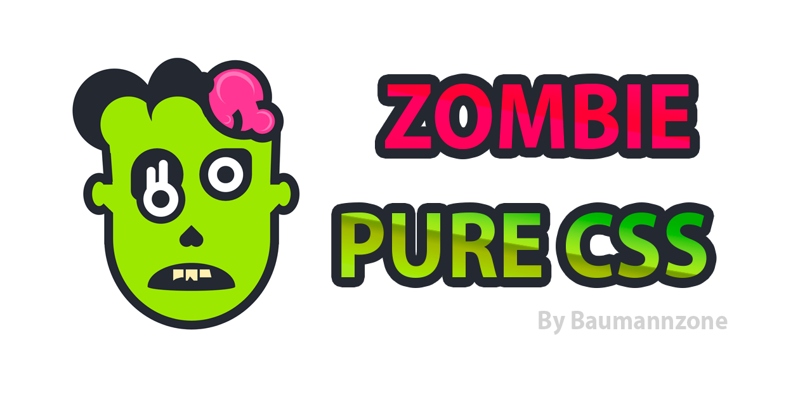

# 🧟‍♀️ Pure CSS Zombie 🧟‍♂️

> On the occasion of the halloween party 🎃 I made this super awesome 🧟‍♀️ Zombie 🧟‍♂️ in CSS.  
> Made with [Vue.js](https://vuejs.org/) & [Stylus CSS](http://stylus-lang.com/). 

[](https://app.netlify.com/sites/zombie-css/deploys)
[](https://github.com/baumannzone/zombie-css/actions)
[](https://img.shields.io/badge/code%20style-standard-brightgreen?style=flat-square)
[](https://github.com/baumannzone/zombie-css/commits/master)
[](https://github.com/baumannzone/zombie-css/blob/master/CODE_OF_CONDUCT.md)




🔥 **Live DEMO**: https://zombie-css.netlify.com/  
📹 **Video**: https://youtu.be/q0_IOxh-V4s  
💻 **Dev Post**: https://dev.to/baumannzone/pure-css-zombie-5fea  
🎨 **Color palette**: https://coolors.co/292c34-ffffff-b4e900-fe338f-ff70b5


---

## Project setup
```
npm install
```

### Compiles and hot-reloads for development
```
npm run serve
```

### Compiles and minifies for production
```
npm run build
```

### Run your tests
```
npm run test
```

### Lints and fixes files
```
npm run lint
```

### Run your unit tests
```
npm run test:unit
```
